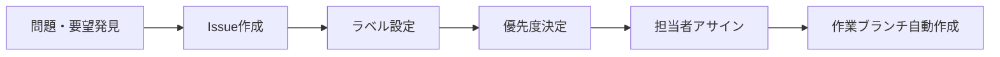
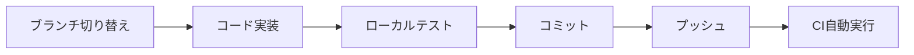
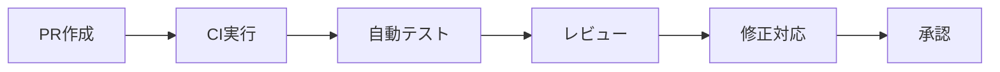
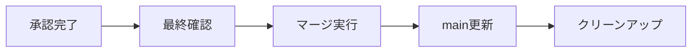

# 🏢 HappyQuest業務フロー・チェックリスト

## 🔄 **標準業務フロー**

### **フェーズ1: Issue作成・計画**


#### **📋 チェックリスト**
- [ ] **Issueテンプレート使用** (`enhancement.yml`, `bug_report.yml`)
- [ ] **適切なラベル設定** (bug, enhancement, security, etc.)
- [ ] **優先度設定** (🔥緊急, ⚡高, 📈中, 📋低)
- [ ] **影響範囲確認** (Docker, MCP, GitHub Actions, セキュリティ)
- [ ] **既存Issue重複チェック**

#### **🤖 自動実行**
```bash
# Issue作成時の自動処理
gh issue create --template enhancement.yml
# → 自動ブランチ作成: feature/issue-123-description
# → WORK_PROGRESS.md 自動生成
```

---

### **フェーズ2: 開発・実装**


#### **📋 チェックリスト**
- [ ] **適切なブランチで作業** (`feature/issue-123-*`)
- [ ] **ローカル環境テスト実行**
  ```bash
  # 基本環境確認
  ./scripts/run-validation.sh
  
  # Docker状況確認
  ./mcp-control.sh status
  ./n8n-control.sh status
  
  # セキュリティチェック
  grep -r "password\|secret\|key.*=" . --include="*.js" --include="*.py"
  ```
- [ ] **コミットメッセージ規約準拠**
  ```
  🔧 Fix: 問題の修正
  ✨ Feat: 新機能追加
  🎯 Refactor: リファクタリング
  📚 Docs: ドキュメント更新
  🔒 Security: セキュリティ対応
  ```
- [ ] **WORK_PROGRESS.md更新**

#### **🚨 エラー発生時の対応**
```bash
# 1. エラー確認
git status
docker ps -a
./mcp-control.sh status

# 2. ログ確認
docker logs [container_name] --tail 50
cat quality-reports/test-results-*.log

# 3. 修正実行
# エラーメッセージに基づいて修正

# 4. 再テスト
./scripts/run-validation.sh
```

---

### **フェーズ3: PR作成・レビュー**


#### **📋 チェックリスト**
- [ ] **PR作成**
  ```bash
  gh pr create --title "🔧 Issue #123: 説明" --body "Closes #123"
  ```
- [ ] **GitHub Actions全通過**
  - [ ] 🎯 Practical CI Pipeline: ✅
  - [ ] 🔒 Basic Security Check: ✅  
  - [ ] 🧹 Code Quality Check: ✅
  - [ ] 🔍 Environment Validation: ✅
- [ ] **レビュー項目確認**
  - [ ] コード品質・可読性
  - [ ] セキュリティ問題なし
  - [ ] パフォーマンス影響確認
  - [ ] ドキュメント更新
- [ ] **テスト結果確認**
  ```bash
  gh run list --branch feature/issue-123-* --limit 5
  gh run view [run_id] --log
  ```

#### **🔄 レビュー対応**
```bash
# レビューコメント確認
gh pr view 123 --comments

# 修正実装
git add .
git commit -m "🔧 Review対応: 指摘事項修正"
git push

# 再度自動テスト実行
```

---

### **フェーズ4: マージ・デプロイ**


#### **📋 マージ手順**
```bash
# 1. 最終状況確認
gh pr checks 123
gh pr view 123 --json reviewDecision

# 2. マージ実行（Squash推奨）
gh pr merge 123 --squash --delete-branch

# 3. ローカル更新
git checkout main
git pull origin main

# 4. 完了したブランチ削除
git branch -d feature/issue-123-*

# 5. Issue自動クローズ確認
gh issue view 123
```

#### **🧹 クリーンアップ**
```bash
# 定期メンテナンス（週次）
git branch --merged main | grep -v main | xargs git branch -d
docker system prune -f
./mcp-control.sh cleanup
```

---

## 🚨 **エラー対応フロー**

### **GitHub Actions失敗時**
```bash
# 1. 失敗詳細確認
gh run view [run_id] --log-failed

# 2. よくある問題と対処
case "エラー種類" in
  "upload-artifact@v3 deprecated")
    # アクションバージョン更新
    sed -i 's/upload-artifact@v3/upload-artifact@v4/g' .github/workflows/*.yml
    ;;
  "package.json not found")
    # 存在チェック追加
    echo 'if [ -f "package.json" ]; then npm test; fi'
    ;;
  "Permission denied")
    # 実行権限付与
    chmod +x scripts/*.sh
    ;;
  "Docker not running")
    # Docker起動
    sudo systemctl start docker
    ;;
esac

# 3. 修正・再実行
git add .
git commit -m "🔧 Fix CI error: [具体的な修正内容]"
git push
```

### **レビュー対応フロー**
```bash
# 1. レビューコメント分析
gh pr view [PR_NUMBER] --comments > review_comments.txt

# 2. 妥当性判断基準
# ✅ 修正すべき: セキュリティ、バグ、パフォーマンス問題
# ⚠️ 検討要: スタイル、設計方針の違い
# ❌ 却下: 過度な要求、プロジェクト方針と矛盾

# 3. 修正実装
# 各指摘事項に対して個別コミット
git add specific_files
git commit -m "🔧 Review対応: [具体的な修正内容]"

# 4. 修正理由をコメント
gh pr comment [PR_NUMBER] --body "修正完了: [修正内容と理由]"
```

---

## 📊 **品質管理チェックポイント**

### **コード品質**
- [ ] **シェルスクリプト**: ShellCheck通過
- [ ] **Python**: 構文エラーなし、PEP8準拠
- [ ] **JavaScript/Node.js**: ESLint通過
- [ ] **Markdown**: リンク切れなし

### **セキュリティ**
- [ ] **シークレット**: 環境変数使用、ハードコードなし
- [ ] **権限**: 最小権限原則
- [ ] **依存関係**: 既知の脆弱性なし

### **パフォーマンス**
- [ ] **Docker**: メモリ使用量監視
- [ ] **MCP**: 不要サービス停止
- [ ] **GitHub Actions**: タイムアウト設定適切

### **運用性**
- [ ] **ログ**: 適切なレベル設定
- [ ] **監視**: ヘルスチェック実装
- [ ] **ドキュメント**: 最新状態維持

---

## 📞 **緊急時対応**

### **システム停止時**
```bash
# 1. 状況確認
./mcp-control.sh status
docker ps -a
free -h

# 2. 緊急復旧
./n8n-control.sh stop  # 重いサービス停止
docker system prune -f  # リソース解放
sudo systemctl restart docker  # Docker再起動

# 3. Issue作成・対応
gh issue create --title "🚨 System Emergency: [状況]" --label emergency
```

### **セキュリティインシデント**
```bash
# 1. 即座にシークレット無効化
# 2. 影響範囲調査
git log --grep="password\|secret\|key" --oneline
# 3. 修正・報告
# 4. 再発防止策実装
```

---

**🎯 このワークフローは継続的改善を行い、プロジェクトの成長に合わせて更新してください。**