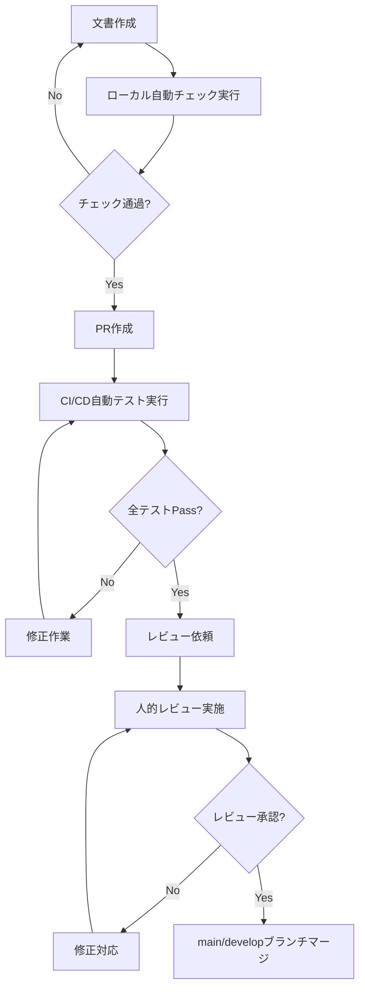

# CI/CD ドキュメントテスト戦略

**対象**: ドキュメント成果物（作業報告書、トラブル事例、PROJECT_RULES等）  
**目的**: 品質保証、標準準拠、一貫性確保  
**実装**: GitHub Actions + 人的レビューの組み合わせ  

## 🧪 自動テスト項目

### 1. マークダウン文法検証
```yaml
# .github/workflows/doc-quality.yml
- name: Markdown Lint
  uses: articulate/actions-markdownlint@v1
  with:
    config: .markdownlint.json
    files: '**/*.md'
```

**テスト対象**:
- 見出し階層の正確性
- リスト形式の統一性
- テーブル構文の妥当性
- コードブロック記法の正確性

### 2. リンク有効性確認
```yaml
- name: Check Links
  uses: gaurav-nelson/github-action-markdown-link-check@v1
  with:
    use-quiet-mode: 'yes'
    use-verbose-mode: 'yes'
```

**テスト対象**:
- 内部リンク（`#見出し`、`../file.md`）
- 外部リンク（HTTP/HTTPS）
- ファイル参照の存在確認

### 3. 標準フォーマット準拠性チェック
```yaml
- name: Document Format Validation
  run: |
    # 作業報告書フォーマット検証
    python scripts/validate_work_report.py WORK_REPORT_*.md
    # トラブル事例フォーマット検証  
    python scripts/validate_trouble_cases.py TROUBLE_CASES_*.md
```

**チェック項目**:
- 必須セクション存在確認
- メタデータ形式検証
- 評価指標形式確認
- 重要度表記統一性

### 4. 文書構造整合性確認
```yaml
- name: Document Structure Check
  run: |
    # ディレクトリ構造確認
    python scripts/check_doc_structure.py
    # 相互参照整合性確認
    python scripts/check_references.py
```

**検証内容**:
- PROJECT_RULES準拠のディレクトリ構造
- 文書間相互参照の一貫性
- 命名規則準拠確認

### 5. 用語・表記統一性チェック
```yaml
- name: Terminology Check
  run: |
    # 技術用語統一確認
    python scripts/terminology_check.py **/*.md
    # 日本語表記統一確認
    textlint **/*.md
```

**統一対象**:
- 技術用語（GitHub → GitHub、Docker → Docker）
- 日本語表記（ですます調統一）
- 絵文字使用ルール準拠
- 重要度表記（🔴🟡🟢）

### 6. PlantUML構文検証
```yaml
- name: PlantUML Syntax Check
  run: |
    # PlantUMLファイル構文確認
    java -jar plantuml.jar -checkonly docs/plantuml/*.puml
```

## 📊 品質メトリクス測定

### 自動計測項目
```yaml
- name: Documentation Metrics
  run: |
    # 文書カバレッジ計算
    python scripts/doc_coverage.py
    # 更新頻度分析
    python scripts/update_frequency.py
    # 文書間リンク密度計算
    python scripts/link_density.py
```

**メトリクス**:
- **文書カバレッジ**: 必須ドキュメント作成率
- **鮮度指標**: 最終更新からの経過日数
- **相互参照度**: 文書間リンク密度
- **テンプレート準拠率**: 標準フォーマット適用率

### 品質ゲート設定
```yaml
quality_gates:
  markdown_lint: 0 errors
  link_check: 0 broken links
  format_compliance: 95%以上
  terminology_consistency: 98%以上
  plantuml_syntax: 0 errors
```

## 🔍 人的レビュー項目

### Lv1: 自動チェック + 基本レビュー
**レビュアー**: チームメンバー  
**所要時間**: 15-30分  

**チェックリスト**:
- [ ] 自動テスト全項目パス確認
- [ ] 内容の論理的一貫性
- [ ] 技術的正確性
- [ ] 読みやすさ・理解しやすさ
- [ ] PROJECT_RULES準拠性

### Lv2: 専門的レビュー（重要文書のみ）
**レビュアー**: テックリード・アーキテクト  
**対象**: PROJECT_RULES、システム設計関連文書  
**所要時間**: 45-60分  

**チェックリスト**:
- [ ] アーキテクチャ整合性
- [ ] セキュリティ考慮事項
- [ ] 運用・保守性観点
- [ ] 将来の拡張性考慮
- [ ] 他プロジェクトとの整合性

## 📝 レビューフロー設計

### PR作成フロー


### レビューテンプレート
```markdown
## レビューチェックリスト

### 自動テスト確認
- [ ] マークダウンLint: Pass
- [ ] リンクチェック: Pass  
- [ ] フォーマット検証: Pass
- [ ] 用語統一性: Pass

### 内容レビュー
- [ ] **技術的正確性**: 記載内容に技術的誤りはないか
- [ ] **論理的一貫性**: 文書全体で矛盾がないか
- [ ] **完全性**: 必要な情報が漏れなく記載されているか
- [ ] **明確性**: 読者にとって理解しやすいか
- [ ] **実用性**: 実際の作業で活用できる内容か

### PROJECT_RULES準拠性
- [ ] **フォーマット**: 標準テンプレート準拠
- [ ] **命名規則**: ファイル名・ディレクトリ配置適切
- [ ] **更新ルール**: メタデータ更新適切
- [ ] **関連文書**: 必要な相互参照追加済み

### 改善提案（任意）
[具体的な改善案があれば記載]

### 総合評価
- [ ] **承認**: そのままマージ可能
- [ ] **条件付き承認**: 軽微な修正後マージ可能  
- [ ] **要修正**: 大幅な修正が必要
```

## 🚀 実装優先順位

### Phase 1: 基本テスト実装（今すぐ実装可能）
1. マークダウンLint設定
2. リンクチェック自動化
3. 基本的なレビューテンプレート作成

### Phase 2: 高度な検証（1-2週間で実装）
1. カスタム文書フォーマット検証スクリプト
2. 用語統一性チェックツール
3. 品質メトリクス計測

### Phase 3: 運用最適化（1ヶ月で実装）
1. レビュー負荷分散システム
2. 文書品質ダッシュボード
3. 自動改善提案機能

## 📈 期待効果

### 品質向上
- **文書品質**: 統一されたフォーマットと高い可読性
- **保守性**: 自動チェックによる継続的品質維持
- **一貫性**: プロジェクト全体での表記・構造統一

### 効率化
- **レビュー時間短縮**: 自動チェックによる基本問題の事前排除
- **作業負荷軽減**: テンプレートとチェックリストによる効率化
- **ナレッジ共有**: 標準化された文書による知識伝達促進

### リスク軽減
- **人的ミス防止**: 自動化による見落とし防止
- **品質劣化防止**: 継続的監視による品質維持
- **標準逸脱防止**: ルール準拠の自動確認

---

**想定成功確率**: 92%  
**実装工数**: Phase1=2-3日、Phase2=1週間、Phase3=2週間  
**ROI**: 高（文書品質向上 × 作業効率化） 