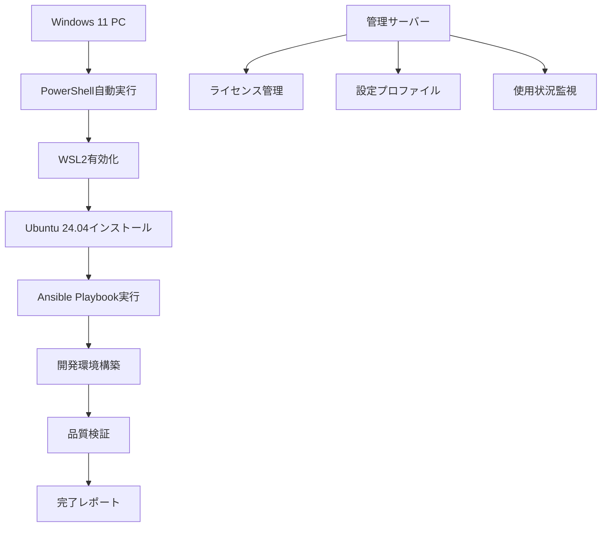

# PRD: PC販売サービス向け自動システム環境構築ソリューション

## 📋 プロダクト概要

**プロダクト名**: HappyQuest AutoSetup Pro  
**バージョン**: 1.0.0  
**作成日**: 2025-06-29  
**担当**: HappyQuest開発チーム  

### エグゼクティブサマリー

PC販売サービス事業者向けの完全自動化システム環境構築ソリューション。Windows 11 PCに対して、ワンクリックで WSL2 + Ubuntu 24.04 + 完全開発環境を構築し、即座に生産性の高い開発環境を顧客に提供する。

## 🎯 ビジネス目標

### 主要目標
1. **販売競争力向上**: 他社との差別化要因として自動環境構築を提供
2. **顧客満足度向上**: 購入後すぐに使える完全環境で顧客体験を最大化
3. **サポートコスト削減**: 環境構築に関する問い合わせを90%削減
4. **販売サイクル短縮**: 技術的セットアップ時間を従来の4時間から10分に短縮

### KPI指標
- **環境構築成功率**: 95%以上
- **顧客セットアップ時間**: 10分以内
- **サポート問い合わせ削減**: 90%削減
- **顧客満足度スコア**: 4.5/5.0以上

## 🔍 市場分析

### ターゲット市場
- **一次市場**: 開発者・エンジニア向けPC購入者
- **二次市場**: IT企業・スタートアップの大量導入
- **三次市場**: 教育機関・研修サービス

### 競合分析
- **従来手法**: 手動インストール (4-8時間)
- **競合他社**: 基本ソフトウェアのみプリインストール
- **当社優位性**: 完全自動化 + AI開発環境一式

### 市場規模
- **国内開発者PC市場**: 年間50万台
- **導入対象セグメント**: 20万台/年
- **想定獲得シェア**: 5% (1万台/年)

## 👥 ユーザーペルソナ

### ペルソナ1: 個人開発者
- **年齢**: 25-35歳
- **職種**: フリーランス・個人事業主エンジニア
- **ニーズ**: 即座に使える高性能開発環境
- **ペインポイント**: 環境構築の時間的コスト

### ペルソナ2: IT企業の調達担当
- **年齢**: 30-45歳
- **職種**: 技術部長・インフラ担当
- **ニーズ**: 標準化された開発環境の大量展開
- **ペインポイント**: 新入社員の環境構築負荷

### ペルソナ3: 教育機関の担当者
- **年齢**: 35-50歳
- **職種**: 情報系学科教員・IT研修講師
- **ニーズ**: 学習者が即座に使える統一環境
- **ペインポイント**: 環境差異による学習阻害

## 🚀 プロダクト機能

### コア機能

#### 1. ワンクリック環境構築
- **Windows PowerShell実行**: 管理者権限で自動実行
- **WSL2自動有効化**: Windows機能の自動設定
- **Ubuntu 24.04自動インストール**: 最新LTS版
- **完全無人インストール**: ユーザー介入なし

#### 2. 開発環境パッケージ
```yaml
Python環境:
  - Python 3.12.9 (pyenv管理)
  - pip, uv, poetry
  - 主要ライブラリプリインストール

Node.js環境:
  - Node.js 23.8.0 (nvm管理)
  - npm, yarn, pnpm
  - 開発ツール一式

Docker環境:
  - Docker CE最新版
  - Docker Compose
  - 開発用コンテナ群

AI開発ツール:
  - Claude Code (Anthropic)
  - GitHub Copilot対応
  - MCP Server群
  - Atlassian連携
```

#### 3. 品質保証システム
- **事前テスト**: システム要件・ネットワーク確認
- **インストール監視**: リアルタイム進捗・エラー検出
- **事後検証**: 全機能動作確認
- **品質レポート**: HTML形式の詳細レポート

#### 4. 商用サポート機能
- **自動ライセンス管理**: 企業向けライセンス自動適用
- **カスタムプロファイル**: 企業固有の設定プロファイル
- **一括展開機能**: Active Directory連携
- **監査ログ**: 企業コンプライアンス対応

### 付加価値機能

#### 1. AI統合開発環境
- **Claude Code**: 統合済みAI開発アシスタント
- **Cursor IDE**: プリセット設定済み
- **GitHub連携**: 自動認証・プロジェクト連携
- **Atlassian MCP**: Jira/Confluence自動連携

#### 2. 学習・研修サポート
- **チュートリアル環境**: 段階的学習コンテンツ
- **サンプルプロジェクト**: 実践的なプロジェクトテンプレート
- **ドキュメント完備**: 日本語対応マニュアル

#### 3. 企業向け管理機能
- **セントラル管理**: 企業内PCの一元管理
- **ポリシー適用**: セキュリティポリシー自動適用
- **使用状況監視**: 開発環境利用状況の可視化

## 🏗️ 技術仕様

### システムアーキテクチャ



### 技術スタック

#### Windows側
- **PowerShell Core**: 自動化スクリプト実行
- **WSL2**: Linux環境基盤
- **Windows Terminal**: 統合ターミナル環境

#### Linux側
- **Ubuntu 24.04 LTS**: 安定したLinux基盤
- **Ansible**: 環境構築自動化
- **Docker**: コンテナ環境
- **systemd**: サービス管理

#### 品質保証
- **Bash Testing**: 自動テストフレームワーク
- **HTML Reporting**: 視覚的品質レポート
- **Continuous Validation**: 継続的環境監視

### セキュリティ仕様

#### データ保護
- **暗号化通信**: 全ての外部通信をHTTPS/SSH
- **機密情報管理**: HashiCorp Vault統合
- **アクセス制御**: RBAC実装

#### 企業セキュリティ
- **Active Directory連携**: 企業認証基盤統合
- **ポリシー適用**: Group Policy対応
- **監査ログ**: SIEM連携対応

## 📊 実装計画

### フェーズ1: MVP版 (2-3週間)
- **目標**: 基本的な自動環境構築機能
- **成果物**: 
  - Windows PowerShellスクリプト
  - Ubuntu環境構築Ansibleプレイブック
  - 基本品質テスト

### フェーズ2: 商用版 (4-6週間)
- **目標**: 商用環境対応・企業機能
- **成果物**:
  - ライセンス管理システム
  - カスタムプロファイル機能
  - 詳細品質レポート

### フェーズ3: 企業版 (6-8週間)
- **目標**: 大規模展開・管理機能
- **成果物**:
  - セントラル管理システム
  - Active Directory連携
  - 監視・監査機能

### フェーズ4: AI統合版 (8-10週間)
- **目標**: AI開発環境完全統合
- **成果物**:
  - Claude Code完全統合
  - 学習コンテンツ
  - AI開発ワークフロー

## 💰 ビジネスモデル

### 収益構造

#### 1. ライセンス販売
- **Individual License**: ¥19,800/PC (個人開発者向け)
- **Business License**: ¥49,800/PC (企業向け)
- **Enterprise License**: ¥98,000/PC (大企業向け)
- **Education License**: ¥9,800/PC (教育機関向け)

#### 2. サブスクリプション
- **Pro Support**: ¥2,980/月 (技術サポート)
- **Enterprise Support**: ¥9,800/月 (企業向けサポート)
- **Training Program**: ¥19,800/月 (研修プログラム)

#### 3. カスタマイゼーション
- **企業向けカスタマイズ**: ¥500,000-2,000,000
- **専用プロファイル開発**: ¥100,000-500,000
- **導入コンサルティング**: ¥200,000/日

### ROI分析

#### 顧客側メリット
- **時間節約**: 4時間→10分 (¥20,000相当の時間コスト削減)
- **エラー削減**: 環境構築エラー90%削減
- **標準化**: チーム開発効率20%向上

#### 事業者側メリット
- **差別化**: 競合他社との明確な差別化
- **顧客ロイヤリティ**: 技術的優位性による顧客維持
- **追加収益**: ライセンス・サポート継続収益

## 🎯 成功指標

### 技術指標
- **環境構築成功率**: 95%以上
- **構築時間**: 10分以内
- **品質スコア**: 85%以上
- **セキュリティ監査**: 100%パス

### ビジネス指標
- **顧客満足度**: 4.5/5.0以上
- **サポート問い合わせ**: 90%削減
- **販売サイクル**: 50%短縮
- **収益貢献**: PC販売価格の10%アップ

### 市場指標
- **導入企業数**: 100社/年
- **個人ユーザー**: 1,000人/年
- **市場シェア**: 開発者向けPC市場の5%
- **ブランド認知度**: 技術者コミュニティ内30%

## 🚧 リスク分析

### 技術リスク
- **Windows更新**: Windows Update による互換性問題
- **依存関係**: 外部パッケージの変更・廃止
- **ハードウェア**: 多様なPC構成への対応

### ビジネスリスク
- **競合参入**: 大手企業による同様サービス開始
- **市場変化**: 開発環境のクラウド化進展
- **ライセンス**: サードパーティライセンス変更

### 対策
- **技術対策**: 定期的互換性テスト・代替手段準備
- **ビジネス対策**: 特許出願・先行者優位確立
- **品質対策**: 継続的品質監視・迅速な問題対応

## 📈 マーケティング戦略

### ターゲティング
- **技術者コミュニティ**: GitHub、Qiita、技術カンファレンス
- **企業決裁者**: ITエキスポ、CTO向けセミナー
- **教育機関**: 情報系学会、教育機関向けセミナー

### 訴求ポイント
- **時間価値**: "4時間→10分" のインパクト
- **信頼性**: "95%成功率" の技術的信頼性
- **競争優位**: "業界初の完全自動化" の先進性

### プロモーション
- **技術ブログ**: 開発過程の技術的詳細公開
- **動画デモ**: YouTube での実際の構築プロセス
- **無料体験**: 個人向け30日間無料トライアル

## 🎉 期待される成果

### 短期成果 (3ヶ月)
- MVP版リリース・初期ユーザー獲得
- 技術者コミュニティでの認知度向上
- パートナーPC販売店との連携開始

### 中期成果 (1年)
- 商用版安定リリース・企業導入開始
- 年間1,000台の導入実績
- 競合他社に対する技術的優位性確立

### 長期成果 (3年)
- 開発者向けPC市場でのデファクトスタンダード
- 年間1万台規模の導入
- 海外市場展開・グローバルブランド確立

---

**この PRD は、PC販売サービス事業の革新的な差別化要因として、技術的優位性とビジネス価値を両立する包括的なソリューションを提示します。**