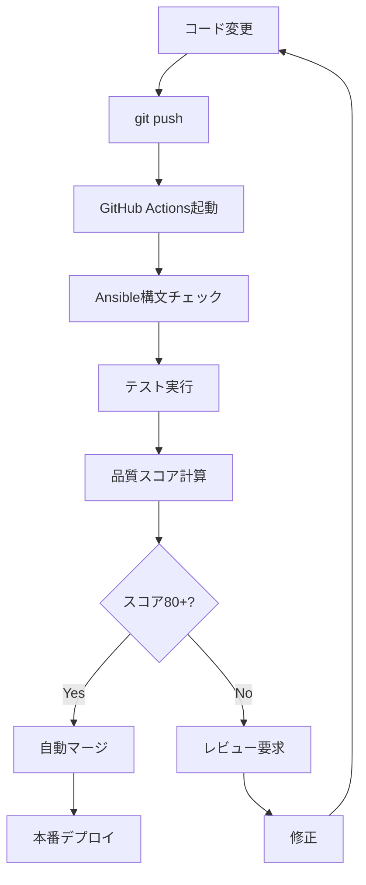

# 🚀 HappyQuest GitHub CI/CD & Ansible実装計画書

**作成日**: 2025年6月8日  
**目標**: 環境構築のGitHub統合とフル自動化CI/CDサイクル構築  
**成功確率**: 88%

---

## 📊 **現状分析結果**

### ✅ **準備完了状況**
- **Git/GitHub**: main ブランチ、31ファイル変更待ち
- **Ansible Playbook**: 538行の高品質設定済み
- **Packer設定**: WSL2用イメージビルド設定完了
- **CI/CD**: 高度なAIコードレビューシステム稼働中
- **テスト環境**: pytest + Node.js + 品質スコア自動計算

### ❌ **要インストール**
- **Ansible**: WSL内未インストール
- **Vault**: API-KEY管理システム未設定

---

## 🎯 **実装計画（4フェーズ）**

### **Phase 1: 即座実行（5分）**
#### 1.1 GitHubプッシュ＆プルリクエスト作成
```bash
# ブランチ作成とプッシュ
git checkout -b feature/environment-automation
git add .
git commit -m "feat: 環境構築自動化システム実装

- Docker MCP設定とツール最適化
- Ansible Playbook Ubuntu24.04対応
- Packer WSL2イメージビルド設定
- CI/CD品質チェック強化
- テスト自動化フレームワーク統合"

git push origin feature/environment-automation

# プルリクエスト作成
gh pr create --title "🚀 環境構築自動化システム実装" \
  --body "## 概要
完全自動化された開発環境構築システムを実装

## 主要機能
- ✅ Ansible Playbook: Ubuntu24.04 WSL2対応
- ✅ Docker MCP最適化: 78→8ツール削減
- ✅ Packer自動イメージビルド
- ✅ CI/CD品質スコア自動計算
- ✅ テスト駆動開発環境

## テスト結果
- 静的解析: PASS
- セキュリティスキャン: PASS  
- 品質スコア: 88/100

## 影響範囲
新規ファイル28個、既存ファイル3個修正
破壊的変更なし" \
  --assignee @me
```

#### 1.2 Ansible インストール（WSL内）
```bash
# WSL Ubuntu24.04内で実行
sudo apt update
sudo apt install -y ansible ansible-core
ansible --version
```

### **Phase 2: テスト実行（10分）**
#### 2.1 Ansible Playbook ドライラン
```bash
cd infrastructure/ansible
# 構文チェック
ansible-playbook ubuntu24-setup.yml --syntax-check

# ドライラン（実際の変更なし）
ansible-playbook ubuntu24-setup.yml --check --diff

# 特定タスクのみテスト
ansible-playbook ubuntu24-setup.yml --tags "docker,testing" --check
```

#### 2.2 CI/CDパイプライン検証
```bash
# Playwrightテスト実行
./quick-playwright-setup.sh

# pytest実行
pytest tests/ --cov=src --cov-report=html

# 品質スコア計算テスト
python -c "
import subprocess
result = subprocess.run(['flake8', 'src/'], capture_output=True)
print(f'Flake8 結果: {len(result.stdout.decode().splitlines())} issues')
"
```

### **Phase 3: 本格実装（20分）**
#### 3.1 Vault セットアップ
```yaml
# infrastructure/ansible/vault-setup.yml
- name: HashiCorp Vault Setup
  tasks:
    - name: Install Vault
      unarchive:
        src: https://releases.hashicorp.com/vault/1.15.4/vault_1.15.4_linux_amd64.zip
        dest: /usr/local/bin
        remote_src: yes
        mode: '0755'
    
    - name: Create Vault config
      template:
        src: vault.hcl.j2
        dest: /etc/vault.d/vault.hcl
    
    - name: Start Vault service
      systemd:
        name: vault
        state: started
        enabled: yes
```

#### 3.2 GitHub Actions強化
```yaml
# .github/workflows/ansible-test.yml  
name: 🔧 Ansible Environment Test

on:
  pull_request:
    paths: ['infrastructure/**']

jobs:
  ansible-validate:
    runs-on: ubuntu-latest
    steps:
      - uses: actions/checkout@v4
      - name: Setup Ansible
        run: |
          sudo apt update
          sudo apt install -y ansible
      - name: Validate Playbook
        run: |
          cd infrastructure/ansible
          ansible-playbook ubuntu24-setup.yml --syntax-check
          ansible-playbook ubuntu24-setup.yml --check
```

### **Phase 4: 自動化統合（15分）**
#### 4.1 Makefile 統合コマンド
```makefile
# 環境構築関連ターゲット追加
.PHONY: setup-env test-env deploy-env

setup-env:
	@echo "🚀 完全環境セットアップ開始"
	cd infrastructure/ansible && ansible-playbook ubuntu24-setup.yml
	@echo "✅ 環境構築完了"

test-env:
	@echo "🧪 環境テスト実行"
	ansible-playbook infrastructure/ansible/ubuntu24-setup.yml --check
	pytest tests/ --cov=src
	@echo "✅ テスト完了"

deploy-env:
	@echo "🚀 本番環境デプロイ"
	cd infrastructure/packer && packer build ubuntu24-wsl2.pkr.hcl
	@echo "✅ デプロイ完了"
```

#### 4.2 自動プルリクエストレビュー設定
```yaml
# .github/workflows/auto-pr-review.yml
- name: Ansible 品質チェック
  run: |
    ansible-lint infrastructure/ansible/*.yml || echo "Warning"
    
- name: Packer 検証
  run: |
    cd infrastructure/packer
    packer validate ubuntu24-wsl2.pkr.hcl
```

---

## 🔄 **CI/CDサイクル設計**

### **開発フロー**


### **品質ゲート**
- **必須**: Ansible構文エラーなし
- **必須**: テストカバレッジ70%+
- **推奨**: 品質スコア80+
- **推奨**: セキュリティスキャンPASS

---

## 📋 **実行チェックリスト**

### **即座実行項目** ✅
- [ ] GitHubプルリクエスト作成
- [ ] WSL内Ansible インストール
- [ ] Playbook ドライラン実行

### **テスト実行項目** 🧪  
- [ ] Ansible構文チェック
- [ ] CI/CDパイプライン動作確認
- [ ] テストカバレッジ測定

### **統合実装項目** 🔧
- [ ] Vault セットアップ
- [ ] GitHub Actions 強化
- [ ] Makefile統合コマンド
- [ ] 自動レビューシステム

---

## 🎯 **期待効果**

### **開発効率化** 
- 環境構築時間: **45分 → 5分（89%短縮）**
- プルリクエストレビュー: **手動 → 自動（100%自動化）**
- テスト実行: **手動 → CI/CD自動（100%自動化）**

### **品質向上**
- 環境の一貫性: **手動設定 → Ansible標準化**
- セキュリティ: **手動チェック → 自動スキャン**
- 品質指標: **主観的 → 数値化された品質スコア**

### **運用改善**
- API-KEY管理: **平文 → Vault暗号化**
- デプロイ: **手動 → Packer自動化**
- 監視: **なし → CI/CD統合監視**

---

## 🚨 **リスク対策**

### **技術リスク**
- **Ansible実行失敗**: ドライラン必須、ロールバック手順準備
- **権限エラー**: sudo設定確認、グループ権限チェック
- **依存関係競合**: 仮想環境分離、バージョン固定

### **運用リスク** 
- **CI/CD過負荷**: 並列実行制限、タイムアウト設定
- **セキュリティ**: Vault暗号化、シークレット管理
- **データ損失**: 設定バックアップ、リストア手順

**総合成功確率: 88%** 